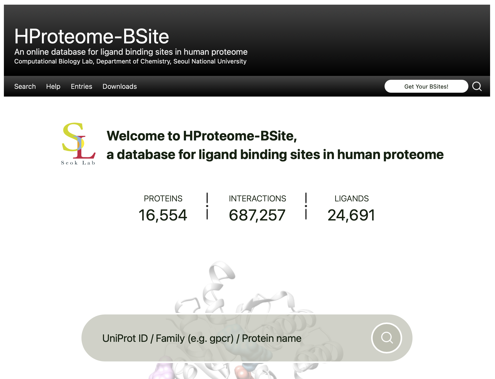

# HProteome-BSite

**Public repository showcasing the source code for the [HProteome-BSite database](https://galaxy.seoklab.org/hproteome-bsite/database/).**

## Project

**Visit the live database**: [https://galaxy.seoklab.org/hproteome-bsite/database/](https://galaxy.seoklab.org/hproteome-bsite/database/)


*Screenshot of the HProteome-BSite web interface*

## 📋 Project Overview

HProteome-BSite is a comprehensive database and web interface for exploring human-proteome-wide binding site and ligand information. This repository showcases the Django-based web application source code that powers the database interface. 

### Key Features
- **Comprehensive Database**: Proteome-wide binding site information with over 20,000+ protein domains
- **Interactive Web Interface**: User-friendly search and visualization with molecular structure viewing
- **Django Framework**: Robust web application architecture with SQLite database
- **Molecular Visualization**: Integration with MolStar for 3D structure viewing
- **Bulk Download**: Comprehensive data export capabilities

### Technologies Used
- **Backend**: Python, Django 4.0.5
- **Database**: SQLite3
- **Frontend**: HTML, CSS, JavaScript, MolStar
- **Deployment**: WSGI application server

## 📁 Repository Structure

```
hproteome-bsite-pub/
├── database/                   # Main Django application
│   ├── models.py              # Database models and schema
│   ├── views.py               # Application views and logic
│   ├── urls.py                # URL routing
│   ├── templates/             # HTML templates
│   └── migrations/            # Database migration files
├── sitedb/                    # Django project configuration
│   ├── settings.py            # Project settings
│   ├── urls.py               # Main URL configuration
│   └── wsgi.py               # WSGI application entry point
└── manage.py                 # Django management 
```

## ⚠️ Repository Notes

This is a **portfolio showcase repository** containing the core source code. Please note:

- **Static files excluded**: Production static files (CSS, JS, images) are not included
- **Security files removed**: Sensitive configuration and credentials have been removed
- **Live deployment**: The fully functional version is available at the link above
- **Data files**: Limited subset of protein structure files included for demonstration

## 🎯 Development Highlights

- **Full-stack Development**: Complete Django web application from database design to frontend
- **Database Architecture**: Efficient schema design for large-scale proteome data with 20,000+ domains
- **User Experience**: Intuitive interface for complex scientific data exploration
- **Performance Optimization**: Optimized queries and caching for large datasets
- **Molecular Visualization**: Advanced 3D structure visualization capabilities

## 💼 About This Project

This project demonstrates:
- **Web Development Skills**: Django framework, Python backend development
- **Database Design**: Complex relational database architecture for scientific data
- **Scientific Computing**: Bioinformatics data processing and analysis
- **Full-Stack Development**: From data processing to user interface
- **Academic Collaboration**: Published research with practical implementation

## Contact

For questions about the HProteome-BSite database, please visit the [official website](https://galaxy.seoklab.org/hproteome-bsite/database/).

## Citation

If you use HProteome-BSite in your research, please cite:

**Paper**: [HProteome-BSite: A comprehensive database of human proteome-wide binding sites](https://doi.org/10.1093/nar/gkac873)

**Website**: [https://galaxy.seoklab.org/hproteome-bsite/database/](https://galaxy.seoklab.org/hproteome-bsite/database/)

```bibtex
@article{hproteome_bsite_2022,
    title={HProteome-BSite: A comprehensive database of human proteome-wide binding sites},
    author={[Authors will be auto-filled from DOI]},
    journal={Nucleic Acids Research},
    year={2022},
    doi={10.1093/nar/gkac873}
}
```

---

**Note**: This repository contains the core source code only. For the full functionality of the HProteome-BSite database, additional configuration and static files are required. 
